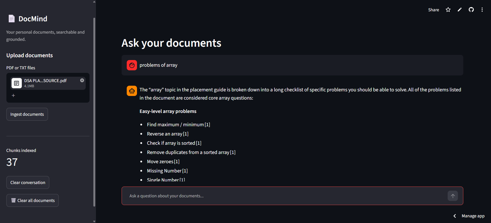

<div align="center">

# 📄 DocMind

**Personal Document Q&A Assistant — chat with your own PDFs and notes, grounded in real citations.**

[](#)
[](#)
[-orange)](#)
[](#)
[](#)

</div>

A RAG (Retrieval-Augmented Generation) application that lets you upload your
own PDFs and notes, then ask questions about them in a chat interface —
with grounded citations, hybrid search, and an honest "I don't know" fallback
when the answer isn't in your documents.

Built entirely on free tools: local embeddings, a lightweight self-built
vector store, and Groq's free-tier LLM API. No paid services, and no
compiled dependencies that require a C++ build toolchain — everything
installs with plain `pip install`.

---

## 📸 Screenshot

<div align="center">
  
</div>

> Replace the placeholder above with your own screenshot: save an image as
> `docs/screenshot.png` in the repo root (create the `docs/` folder if it
> doesn't exist yet), and it will render automatically here and on GitHub.
> A GIF works too — just point the `src` at `docs/demo.gif` instead.

---

## Table of contents

- [Features](#features)
- [Architecture](#architecture)
- [Setup](#setup)
- [Deploying for free](#deploying-for-free)
- [Project structure](#project-structure)
- [Why no ChromaDB?](#why-no-chromadb)
- [Talking points for interviews](#talking-points-for-interviews)

---

## Features

1. **Smart chunking with overlap** — documents are split on paragraph/sentence
   boundaries (not blind character cuts), with overlapping context between
   chunks so information isn't lost at chunk edges.
2. **Source citations** — every answer includes `[1]`, `[2]` style citations
   that map back to the exact source file and page number.
3. **Hybrid search** — combines dense vector search (semantic meaning) with
   BM25 keyword search (exact terms/names/dates), merged via Reciprocal Rank
   Fusion. Catches both "what did I write about motivation" (semantic) and
   "what's my AWS account ID" (exact keyword) style queries.
4. **Conversation memory** — follow-up questions like "what about the second
   one?" or "time complexity of each?" get combined with the previous
   question before retrieval runs, using a simple rule (pronouns like "it"/
   "each"/"that", or very short questions, signal a follow-up) rather than
   an LLM call. An LLM-based rewrite was tried first but proved unreliable
   on a small, fast model — it would occasionally invent a connection to
   the wrong earlier topic. The deterministic rule is less flexible but
   predictable, which matters more here.
5. **Confidence-based fallback** — if retrieval similarity is too low, the
   app says it doesn't know rather than letting the LLM hallucinate an
   answer.

---

## Architecture

```
                 ┌──────────────┐
   PDF/TXT  ───► │   ingest.py  │  chunk (overlap) → embed → store
                 └──────┬───────┘
                        │
                        ▼
                 ┌──────────────┐
                 │ vectorstore  │  (numpy cosine search + metadata,
                 │   .py        │   persisted to a local pickle file)
                 └──────┬───────┘
                        │
   query ──► reformulate (llm.py) ──► hybrid_retrieve (retrieval.py)
                                            │
                              vector search ┼ BM25 search
                                            │
                                   Reciprocal Rank Fusion
                                            │
                                  confidence check (Feature 5)
                                            │
                                            ▼
                                   generate_answer (llm.py)
                                            │
                                            ▼
                                  answer + citations (app.py)
```

---

## Setup

### 1. Install dependencies
```bash
pip install -r requirements.txt
```

### 2. Get a free Groq API key
Sign up at [console.groq.com](https://console.groq.com/keys) — free tier,
no credit card required.

### 3. Configure environment
```bash
cp .env.example .env
# then edit .env and paste your GROQ_API_KEY
```

### 4. Run the app
```bash
streamlit run app.py
```

Open the URL Streamlit prints (usually `http://localhost:8501`), upload a
PDF or text file from the sidebar, click **Ingest documents**, and start
asking questions.

### Optional: bulk ingest via CLI
Drop files into the `data/` folder and run:
```bash
python ingest.py
```

---

## Deploying for free

Push this repo to GitHub, then deploy on
[Streamlit Community Cloud](https://streamlit.io/cloud) for free. Add your
`GROQ_API_KEY` as a secret in the app settings instead of committing `.env`.

---

## Project structure

```
docmind/
├── app.py            # Streamlit UI, ties all features together
├── ingest.py         # PDF/text parsing, chunking, embedding, storage
├── vectorstore.py    # Self-built numpy cosine-similarity vector store
├── retrieval.py      # Hybrid search (vector + BM25) + confidence check
├── llm.py            # Groq API calls, query reformulation, citations
├── config.py         # All tunable settings in one place
├── requirements.txt
├── .env.example
├── docs/
│   └── screenshot.png  # ← drop your app screenshot here
└── data/              # Uploaded documents land here
```

---

## Why no ChromaDB?

An earlier version used ChromaDB, but its `chroma-hnswlib` dependency needs
a C++ compiler to build from source on Windows unless you install Visual
C++ Build Tools. Since this project is meant to be a zero-friction, zero-cost
demo, `vectorstore.py` implements the same idea (store embeddings, search by
similarity, keep metadata for citations) in ~80 lines of plain numpy — no
compiler required, and it's genuinely a good interview talking point that
you understand what a vector index does under the hood rather than treating
it as a black box.

---

## Talking points for interviews

- **Chunking strategy**: explain *why* paragraph/sentence-aware chunking
  with overlap beats naive fixed-size splitting (avoids cutting sentences
  mid-thought, preserves context across chunk boundaries).
- **Hybrid retrieval**: explain why pure vector search misses exact-match
  queries (names, IDs, dates) and how BM25 + Reciprocal Rank Fusion fixes
  that without needing a re-ranker model.
- **Confidence fallback**: discuss the trade-off in picking a distance
  threshold — too strict and it refuses valid questions, too loose and it
  hallucinates.
- **Conversation memory**: explain the decision to replace an LLM-based
  query rewriter with a deterministic rule after testing showed the LLM
  version was unreliable on a small/fast model — a good example of
  choosing robustness over sophistication when it matters for correctness.
- **What you'd improve with more time**: re-ranking with a cross-encoder,
  streaming responses, an evaluation harness (retrieval recall@k, answer
  faithfulness).